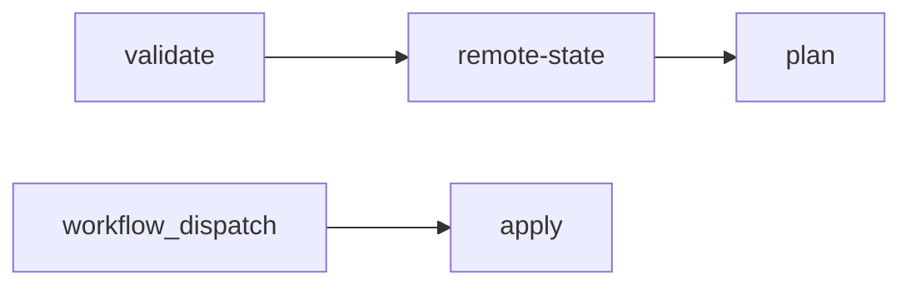

# Задание 2. Интеграция с CI/CD и удалённым хранением состояния

Автоматизация развёртывания инфраструктуры «Будущее 2.0» через CI/CD с **удалённым Terraform state** в S3-совместимом хранилище (MinIO / Yandex Object Storage / AWS S3).

## Структура проекта

```
Task2Advanced/
├── modules/vm/                 # Модуль ВМ (из задания 1)
├── envs/
│   ├── dev/
│   ├── stage/
│   └── prod/                   # backend "s3" + отдельный key на окружение
├── config/                     # Примеры backend.hcl
├── scripts/                    # Вспомогательные скрипты
├── docker-compose.yml          # Локальный MinIO
├── .gitlab-ci.yml              # Альтернатива GitHub Actions
└── README.md

.github/workflows/task2-terraform.yml   # Основной CI/CD (в корне репозитория)
```

## Удалённый backend (S3)

В `envs/<env>/versions.tf` настроен partial backend:

```hcl
backend "s3" {}
```

Параметры **не хранятся в коде** — передаются через `-backend-config=backend.hcl`:

| Параметр | Назначение |
|----------|------------|
| `bucket` | Имя bucket для state |
| `key` | Путь к файлу state (`envs/dev/terraform.tfstate` и т.д.) |
| `endpoints.s3` | URL S3 API (MinIO, Yandex Object Storage) |
| `use_path_style` | Обязательно для MinIO |

### Изоляция окружений

Каждое окружение использует **отдельный ключ** в одном bucket:

| Окружение | State key |
|-----------|-----------|
| dev | `envs/dev/terraform.tfstate` |
| stage | `envs/stage/terraform.tfstate` |
| prod | `envs/prod/terraform.tfstate` |

Локальный `terraform.tfstate` **не используется** и добавлен в `.gitignore`.

## Скрипты

### `scripts/setup-minio.sh`

Запускает MinIO через Docker Compose и создаёт bucket `budushee-terraform-state`.

```bash
./scripts/setup-minio.sh
export AWS_ACCESS_KEY_ID=minioadmin
export AWS_SECRET_ACCESS_KEY=minioadmin
cp envs/dev/backend.hcl.example envs/dev/backend.hcl
```

### `scripts/generate-backend-config.sh`

Генерирует `backend.hcl` / `backend.ci.hcl` из переменных окружения (для CI/CD).

```bash
export TF_STATE_BUCKET=budushee-terraform-state
export TF_STATE_ENDPOINT=http://127.0.0.1:9000
export TF_STATE_KEY=envs/dev/terraform.tfstate
./scripts/generate-backend-config.sh dev envs/dev/backend.hcl
```

Переменные:

| Переменная | По умолчанию | Описание |
|------------|--------------|----------|
| `TF_STATE_BUCKET` | — (обязательно) | Имя bucket |
| `TF_STATE_ENDPOINT` | — (обязательно) | S3 endpoint |
| `TF_STATE_KEY` | `envs/<env>/terraform.tfstate` | Ключ объекта |
| `TF_STATE_REGION` | `us-east-1` | Регион |

### `scripts/terraform-init.sh`

`terraform init` с удалённым backend для указанного окружения.

```bash
./scripts/terraform-init.sh dev
```

### `scripts/validate.sh`

Проверка синтаксиса через Docker **без** MinIO и облака:

```bash
./scripts/validate.sh
```

## Локальный запуск

### 1. MinIO + backend

```bash
cd Task2Advanced
./scripts/setup-minio.sh
export AWS_ACCESS_KEY_ID=minioadmin
export AWS_SECRET_ACCESS_KEY=minioadmin
cp envs/dev/backend.hcl.example envs/dev/backend.hcl
```

### 2. Init / Plan / Apply

```bash
cd envs/dev
terraform init -backend-config=backend.hcl
terraform plan -var-file=terraform.tfvars
terraform apply -var-file=terraform.tfvars
```

### Yandex Object Storage

Скопируйте `config/backend.yandex.hcl.example` → `envs/<env>/backend.hcl`, укажите статические ключи сервисного аккаунта:

```bash
export AWS_ACCESS_KEY_ID=<access-key>
export AWS_SECRET_ACCESS_KEY=<secret-key>
```

## CI/CD (GitHub Actions)

Файл: [`.github/workflows/task2-terraform.yml`](../.github/workflows/task2-terraform.yml)

### Этапы пайплайна



| Job | Когда | Действие |
|-----|-------|----------|
| **validate** | PR, push | `fmt`, `init -backend=false`, `validate` |
| **remote-state** | PR, push | MinIO + `init` с S3 backend, проверка отсутствия локального state |
| **plan** | PR, push | `init` + `plan`, артефакт `tfplan` |
| **apply** | Только `workflow_dispatch` | `plan` + `apply` после approval |

### Apply по кнопке (с approval)

1. В GitHub: **Actions** → **Task2 — Terraform CI/CD** → **Run workflow**
2. Выберите окружение: `dev` / `stage` / `prod`
3. В поле `confirm_apply` введите: `apply`
4. Для `stage` и `prod` настройте **Environment protection rules** (required reviewers) в Settings → Environments

### Secrets (Settings → Secrets and variables → Actions)

| Secret | Назначение |
|--------|------------|
| `TF_STATE_ACCESS_KEY` | Ключ S3 / MinIO |
| `TF_STATE_SECRET_KEY` | Секрет S3 / MinIO |
| `TF_STATE_ENDPOINT` | Endpoint (prod: `https://storage.yandexcloud.net`) |
| `TF_STATE_BUCKET` | Имя bucket |
| `YC_TOKEN` | Токен Yandex Cloud (для plan/apply ВМ) |
| `YC_FOLDER_ID` | Каталог YC |
| `YC_SUBNET_ID` | Подсеть |
| `SSH_PUBLIC_KEY` | SSH-ключ |

Без `YC_TOKEN` job **plan** завершится с предупреждением (remote state при этом проверяется).

### GitLab CI

Альтернативный пайплайн: [`.gitlab-ci.yml`](.gitlab-ci.yml). Stage **apply** — `when: manual`.

## Безопасность

- Секреты и `backend.hcl` **не коммитятся** (см. `.gitignore`)
- Отдельный state key на каждое окружение
- `apply` только вручную через `workflow_dispatch` + подтверждение `apply`
- GitHub Environments с approval для `stage` и `prod`
- `TF_IN_AUTOMATION=true` в CI
- Чувствительные переменные (`ssh_public_key`) помечены `sensitive = true`

## Проверка без облака

```bash
cd Task2Advanced
./scripts/validate.sh
```

Проверка remote state локально:

```bash
./scripts/setup-minio.sh
export AWS_ACCESS_KEY_ID=minioadmin AWS_SECRET_ACCESS_KEY=minioadmin
./scripts/terraform-init.sh dev
# Убедитесь, что terraform.tfstate не появился локально
ls envs/dev/terraform.tfstate 2>/dev/null && echo "ОШИБКА: локальный state" || echo "OK: state удалённый"
```
